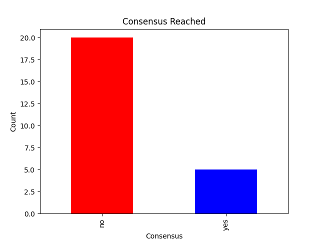

# Graph, Data Analysis and Interpretation

## Graph of consensus reached and not reached

**Fig 1:1** Consensus Reached

The above plot shows a bar chart. The red bar representing **No**(Consensus not reached) and the blue representing **Yes** (Consensus reached).
The above analysis show that a greater percentage of the vote count did not reach consensus.

## Graph of the actual data compared to the aggregation of consensus reached

## Officials in agrreement compared with total officials

## Check Performance/ traffic/ saturation/Latency 

## Graph of total polling station, total polling agent, total candidate, total vote count