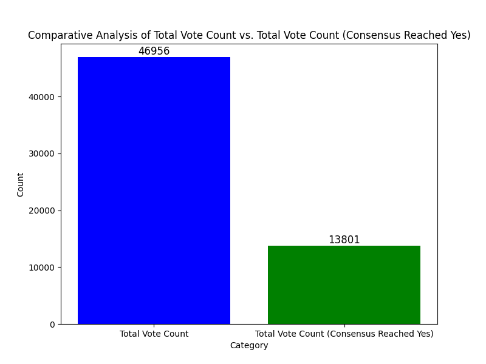

# Data Analysis, Interpretation And Visualization

## Introduction

The presented data analysis and visualization provide valuable insights into various aspects of a blockchain-based election system, offering a comprehensive understanding of the data trends and outcomes. The data includes information about consensus reached, transaction performance, traffic patterns, and election-related statistics. These insights can be instrumental for decision-makers, network operators, and stakeholders in making informed decisions, optimizing system performance, and assessing the efficacy of the election process.

## Graph of consensus reached and not reached

**Fig 1** Consensus Reached

The above plot shows a bar chart. The red bar representing **No**(Consensus not reached) and the blue representing **Yes** (Consensus reached).
The above analysis show that a greater percentage of the vote count did not reach consensus.

**X-Axis Label ("Consensus"):** This label specifies the categories being plotted on the x-axis, which are different types of consensus.

**Y-Axis Label ("Count"):** The label on the y-axis indicates that the count of occurrences is being measured.

**Interpretation:**

- This plot is a bar chart that shows the distribution of different consensus outcomes.
- It helps visualize how many times each type of consensus outcome (e.g., "Yes" or "No") has been reached in the data.
- By observing the height of the bars, you can quickly determine the frequency or count of each consensus outcome.
- The colors differentiate between different types of consensus outcomes. In this case, red and blue bars represent different consensus results, such as "Consensus Reached - Yes" and "Consensus Reached - No."

Given the above interpretation and the bar chart. It shows that only about 5% of the of the officials arrived at a consensus level the remaining 95% did not reach consensus.

## Graph of the actual data compared to the aggregation of consensus reached

**Fig 2** Comparative Analysis of Actual Vote Count and Consensus Vote Count

**Interpretation:**

The bar on the left, labeled 'Total Vote Count,' represents the total vote count for all data in the CSV file, irrespective of whether 'Consensus Reached' is 'Yes' or not.

The bar on the right, labeled 'Total Vote Count (Consensus Reached Yes),' represents the total vote count, considering only the rows where 'Consensus Reached' is 'Yes.'

The plot allows you to visually compare these two categories of vote counts. It's a straightforward way to see how the total vote count changes when 'Consensus Reached' is 'Yes' and when it is not. The color-coding (blue and green) helps distinguish between the two categories.

This information is useful for understanding the impact of 'Consensus Reached' on the total vote count 

The above plot shows that the total number of vote count is greater than the aggregate consensus vote count. Only about 10% of the vote count submitted will be taken into consideration as those were the vote count that reached consensus.

## Officials in agreement compared with total officials
**Fig 3** Officials in Agreement vs Total Officials

**Y-Axis (Count):** The y-axis represents the count, which measures the number of officials in agreement and the total number of officials (N).

**Y-Axis Label ("Count"):** The label on the y-axis specifies that the count is being measured.

**Legend:** The legend on the plot explains the color code for the bars. The green bars represent "Officials in Agreement," while the blue bars represent "Total Number of Officials (N)."

**Interpretation:**

- This plot provides a visual comparison between the count of officials who are in agreement and the total number of officials.
- By observing the height of the bars, it can be determined whether most officials are in agreement or if there is a significant disagreement on the vote count.
- The plot is useful for decision-makers or officials to quickly grasp the level of consensus or disagreement among a group of officials.
- If the green bars (Officials in Agreement) are close in height to the blue bars (Total Number of Officials), it indicates a high level of agreement. Conversely, if the green bars are significantly shorter, it suggests a lower level of agreement.

In summary, this plot is a visual tool for officials to assess and understand the degree of consensus or agreement among a group of officials in a clear and concise manner. 
And the above plot shows a significant level of disagreement between the officials. Which means little level of consensus was reached.

## Performance/ traffic/ Saturation/Latency  Analysis

### Transaction Performance Metric Analysis

**Fig 4** Transaction Metrics

The above plot visualizes the transaction confirmation time over different confirmed rounds.

**Interpretation:** 

The plot allows you to observe how the confirmation time for transactions varies over different rounds. You can look for patterns, spikes, or fluctuations in confirmation times. Sudden peaks may indicate delays in transaction processing, while valleys represent quicker confirmations.
There was a delay in the transaction at point 35000 seconds which was confirmed in 3.20 confirmed rounds.

### Transaction Throughput Over Rounds Analysis

**Fig 5** Transaction Throughput

The above plot visualizes transaction throughput over different confirmed rounds

**Interpretation:**

The above plot helps you understand the capacity of the system to process transactions. It shows how many transactions were confirmed per second during different rounds. Higher peaks indicate better throughput, while lower values may suggest congestion or reduced processing capacity.
At confirmed round of 3.20 and 3.222 and 3.23 there was a higher peak which signifies better throughput.

### Saturation Analysis

Saturation refers to the point at which a network reaches its processing capacity. The saturation analysis checks for network's capacity and congestion.

**Fig 6** Saturation Analysis

The above plot shows a line graph, where each point on the line corresponds to a specific timestamp (time) and its associated transaction fee. The points are marked with circular markers ("o") connected by lines ("-"). This visualization method allows you to track changes in transaction fees over time.

**X-Axis (Timestamp):** The x-axis represents time in the form of timestamps. It shows when the transactions were confirmed. This axis allows you to track the progression of time.

**Y-Axis (Transaction Fee in Algos):** The y-axis represents the transaction fee in Algos. It quantifies the cost associated with each transaction. Transaction fees are typically used to incentivize network nodes to process and confirm transactions.

**Title ("Saturation Analysis"):** The title of the plot indicates that it is related to saturation analysis. 

**Interpretation:**

- The plot provides an overview of how transaction fees change over time. It can help you identify trends and patterns in transaction fees on the blockchain network.

- Rising transaction fees might indicate increased demand for network resources, potentially suggesting network congestion.

- Falling transaction fees may indicate reduced demand or improved network efficiency.

- Sudden spikes in transaction fees could be linked to particular events, such as a surge in network usage or the introduction of new applications or assets on the blockchain.

- A consistent flat line could suggest stability in the network with relatively constant transaction fees.

The above Saturation Analysis plot shows a consistent flat transaction fee across different timestamp and transactions. This suggest stability in the Algorand network.
Understanding how transaction fees change over time is essential for blockchain users, developers, and network operators to make informed decisions and adapt to changing conditions on the network. The visualization can also be useful for forecasting and optimizing transaction costs.

### Latency Analysis

**Fig 7** Latency Analysis

This plot helps in understanding the latency in the confirmation of transactions over a period.
The plot is a line graph, with each data point represented as a circular marker ("o") connected by lines ("-"). This visualization method allows you to track changes in latency over time.

Interpretation:

- The plot provides insights into the latency experienced by transactions on the blockchain network.

- An upward trend in latency suggests that transaction confirmation times are increasing, which might indicate network congestion or increased demand.

- A downward trend in latency indicates decreasing confirmation times, potentially due to network optimization or reduced demand.

- Spikes in latency might be linked to specific events or congestion periods when transactions are taking longer to confirm.

- Consistent, stable latency indicates that the network is maintaining a relatively constant confirmation time.

- Fluctuations in latency can reveal patterns and help users and developers understand the performance of the blockchain network at different times.

This plot is valuable for assessing the efficiency and responsiveness of the blockchain network in processing transactions. Monitoring and analyzing latency trends can assist in making informed decisions about when to submit transactions to achieve desired confirmation times and to identify periods of network stress or congestion.

The above plot indicate an upward trend in latency which suggest that confirmation times are increasing, which might indicate network congestion or increased demand.

### Traffic Analysis

This type of plot is useful for understanding transaction behavior and identifying trends or anomalies in the dataset over time. It can be helpful for monitoring network activity, identifying peak usage times, or analyzing the impact of specific events on transaction traffic.

**Fig 8** Traffic Analysis

The above plot counts the number of transactions in each round and plots the results as a line chart. Here's an interpretation of the plot:

**X-Axis (Confirmed Round):** This represents the "confirmed round" of the transactions, which appears to be a measure of time or sequence of events. As the confirmed round increases, it indicates the progression of time or the order in which transactions were confirmed.

**Y-Axis (Number of Transactions):** This axis represents the number of transactions that were confirmed in each round. It measures the intensity of transaction activity during each round.

**Title ("Transactions Traffic"):** The title of the plot provides an overall description of what the plot is visualizing. In this case, it's showing the traffic or activity related to transactions.

**Interpretation:** 

The plot shows how the number of transactions varies over time (confirmed rounds). You can see patterns, spikes, or fluctuations in transaction activity. For example, if there are sudden peaks in the graph, it suggests moments of high transaction activity, while flat regions indicate periods with lower transaction volumes. 
The above graph shows flat regions which indicate a prolong moments of low transactions.

**Grid Lines:** The grid lines help in reading the values more accurately and are present in both the X and Y axes.

## Graph of total polling station, total polling agent, total candidate, total vote count

The plot below shows the bar chart of transaction trends across different categories and their respective values in the y-axis.
It helps in identifying patterns or trends within the data and allows users to assess how different categories are distributed or how their values have evolved over time.

**Fig 9** Election data (Blockchain Inputted Data)

- The `candidate_counter` represents the total number of registered candidates
- The `polling_agent_counter` represents the total registered polling agents
- The `polling_station_counter` represents the total registered polling stations
- The `submission_counter` represents the total number of vote counts

## Summary of Findings

**Consensus Reached**

The analysis of consensus outcomes revealed that a significant percentage of the vote count did not reach consensus. In **fig.1** The red bars represent "No" (Consensus not reached), while the blue bars represent "Yes" (Consensus reached). This indicates a level of disagreement or non-uniformity in the election process.

**Transaction Performance**

The analysis of transaction performance metrics, including transaction confirmation time and throughput, provided valuable insights into how different rounds of transactions are processed. Patterns, delays, and transaction spikes were observed, which is vital for understanding network performance and efficiency.
There was a delay in the transaction in **fig.4** at point 35000 seconds which was confirmed in 3.20 confirmed rounds.

**Saturation Analysis**

The saturation analysis of transaction fees over time showed a consistent flat transaction fee trend, suggesting stability within the Algorand network. Understanding changes in transaction fees is essential for blockchain users and operators to adapt to evolving network conditions.

**Latency Analysis**

The latency analysis revealed an upward trend in latency, indicating that transaction confirmation times were increasing. This might be due to network congestion, emphasizing the need for monitoring and addressing such issues.

**Traffic Analysis**

The traffic analysis, which focused on transaction counts across confirmed rounds, was instrumental for understanding transaction behavior, peak usage times, and the impact of specific events on transaction traffic. It helped identify moments of low transaction activity.
**Fig.8** Shows a flat linear region which indicate a long period of low transactions.

**Election Data Insights**

The analysis of election-related statistics, including the total number of candidates, polling agents, polling stations, and vote counts, offered insights into the scale and scope of the election process. It provided a comprehensive view of the election-related data.

## Conclusion

In conclusion, this data analysis and visualization provide a comprehensive view of blockchain-based election data. 

It sheds light on consensus outcomes, transaction performance, traffic patterns, and election statistics. 

Overall, the Algorand blockchain is a good fit for this research as it's transaction fee cost only 0.001 algo which remains the same irrespective of the congestion of the network.Transactions are easily and quickly confirmed.

Furthermore, a more accurate consensus level would been reached if the election result submitted by the different polling agents in the different polling stations are publicly available and not just the summary of already collated result.
These insights are invaluable for optimizing system performance, understanding transaction dynamics, and enhancing the election process's integrity.
Stakeholders, officials, and network operators can use these findings to make data-driven decisions and continually improve the blockchain-based election system. It underscores the importance of data analysis in ensuring transparency, efficiency, and trust in the election process within a blockchain network.

